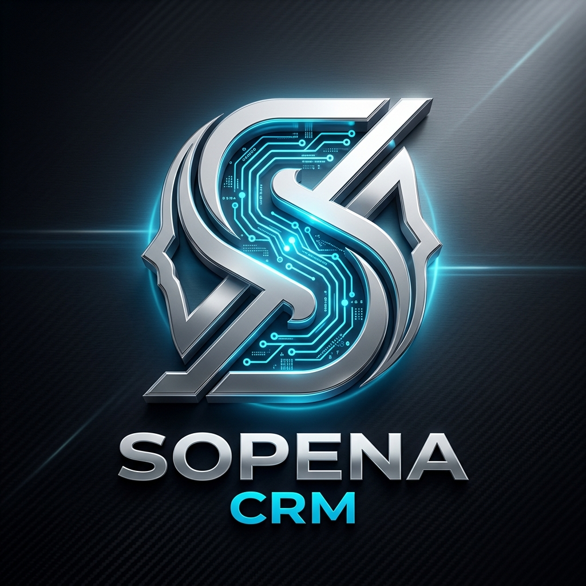
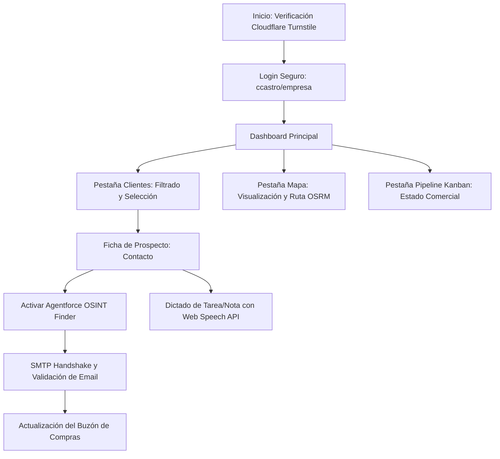
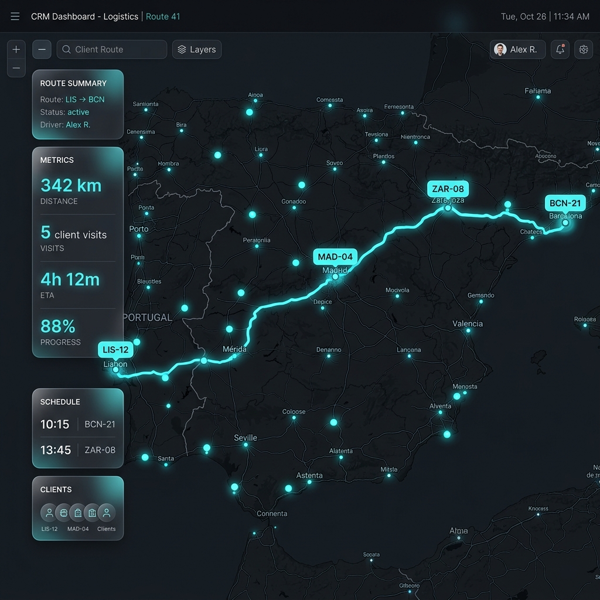
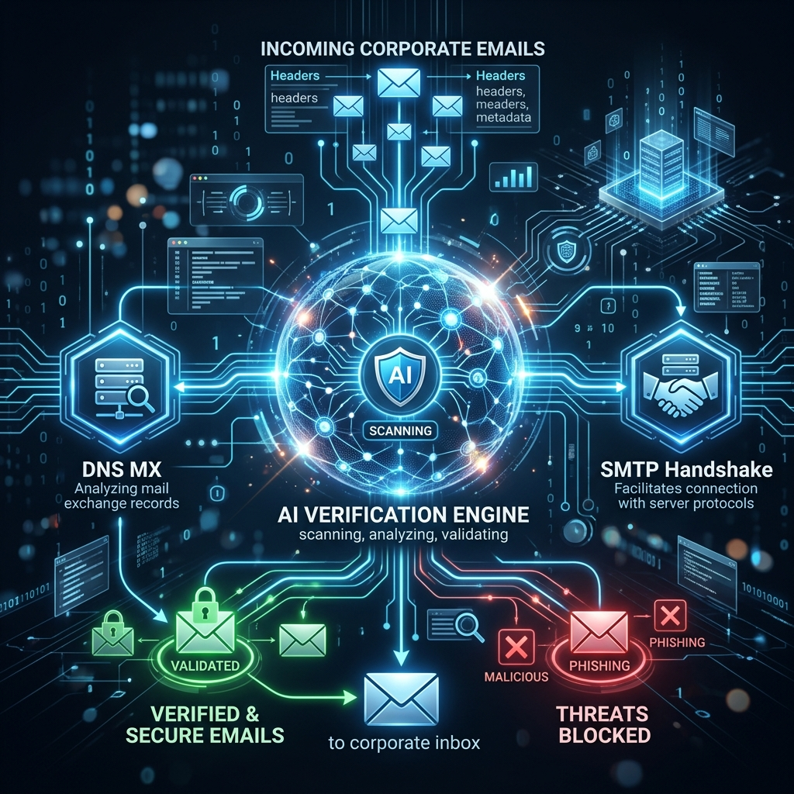

# 🎓 Informe Ejecutivo del Proyecto Final: CRM de la Empresa de Aluminio
**CRM Inteligente de Prospección y Georuta con IA Agentforce para la Industria del Aluminio**

**Alumno:** Jose Vicente Catala Villar  
**Fecha:** 10 de Junio de 2026  
**Herramientas:** Google Antigravity, React 19, Leaflet, OSRM API, Speech Recognition API, jsPDF, html2canvas, Vite  
**Demo local:** http://localhost:5173  
**Repositorio:** [carmen](file:///c:/Users/usuario/Desktop/carmen)

---

## 1. Resumen ejecutivo

El proyecto **CRM de la Empresa de Aluminio** es una solución de prospección comercial inteligente de extremo a extremo diseñada para una empresa metalúrgica especializada en la extrusión de aluminio. El CRM automatiza las tareas críticas de captación del equipo comercial, tales como la geolocalización de clientes potenciales en un mapa interactivo de la península ibérica, el cálculo de rutas óptivas de visita comercial por carretera utilizando la API de OSRM (resolviendo el problema del agente viajero), y la extracción y validación de correos electrónicos de los departamentos de compras mediante el asistente inteligente **Agentforce OSINT Finder**. 

La aplicación optimiza las campañas comerciales de correo frío y reduce los tiempos improductivos de planificación y transporte, convirtiendo un proceso analógico de alta fricción en un flujo de trabajo digital automatizado, seguro y auditable.



---

## 2. Descripción del problema

### 2.1 El problema
En el sector industrial de la extrusión de aluminio, la prospección de clientes (carpinterías de aluminio, fabricantes de ventanas, fachadas y estructuras) es altamente ineficiente. El equipo comercial de la empresa de aluminio se enfrenta a tres fricciones operativas principales en su día a día:
1. **Planificación de rutas subóptimas:** Los comerciales organizan sus visitas en carretera de manera manual o intuitiva, lo que provoca trayectos redundantes, mayor consumo de combustible y un número muy limitado de visitas diarias.
2. **Datos de contacto obsoletos o genéricos:** El uso de correos genéricos (`info@`, `contacto@`) o correos autogenerados ("placeholders") en las campañas de captación reduce drásticamente las tasas de apertura y provoca bloqueos por SPAM. Encontrar el correo real del responsable de compras es una tarea lenta y manual.
3. **Registro ineficiente de la actividad:** Tras cada visita comercial, redactar informes a mano en movilidad consume tiempo valioso y genera pérdida de detalles críticos.

### 2.2 Stakeholders

| Stakeholder | Necesidad | Problema actual | Impacto |
|---|---|---|---|
| **Comerciales en Ruta (Comercial de ruta)** | Planificar visitas comerciales rápidas y registrar notas de reuniones ágilmente. | Pérdida de tiempo al conducir rutas mal calculadas y registrar datos a mano. | Agotamiento físico, menos visitas por día y baja precisión en el registro de clientes. |
| **Director de Ventas** | Supervisar el pipeline comercial de la empresa y hacer previsiones de ingresos fiables. | Datos fragmentados y falta de trazabilidad en las fases de contacto del cliente. | Dificultad para estimar objetivos mensuales y pérdida de oportunidades de venta. |
| **Responsables de Aprovisionamiento (Clientes)** | Recibir ofertas personalizadas relevantes y a tiempo. | Correos de captación enviados a buzones genéricos desatendidos. | Ninguna respuesta de interés, ofertas ignoradas. |

### 2.3 Coste actual estimado

Se ha calculado el impacto monetario del problema para una plantilla de 6 comerciales a nivel nacional, basándose en registros históricos de ventas y planificación analógica:

| Concepto | Valor | Fuente |
|---|---:|---|
| Volumen mensual de empresas prospectadas por comercial | 20 leads | Histórico del departamento de ventas |
| Tiempo de planificación de rutas y búsqueda de emails por lead | 40 min | Mediciones de comerciales en ruta |
| Tiempo total de prospección y logística manual al mes | 13.3 horas | Cálculo (20 leads × 40 min / 60) |
| Coste/hora estimado del perfil comercial | 25 €/hora | Coste de personal de la empresa |
| Coste mensual en horas improductivas de planificación | 332,5 € | Cálculo directo por comercial |
| Gasto mensual adicional en combustible por rutas ineficientes | 120 € | Tickets de combustible estimados |
| **Coste total mensual del problema por comercial** | **452,5 €** | **Suma de pérdidas de tiempo y logística** |
| **Coste anual total del problema (6 comerciales)** | **32.580 €** | **Proyección anual de ineficiencia** |

### 2.4 Nuevos riesgos que podría generar la solución

| Posible problema | Causa | Medida preventiva |
|---|---|---|
| Inexactitud en la ruta por carretera | Limitación temporal de la API pública de mapas OSRM. | Incluir una alerta visual y un botón para abrir la ruta directamente en Google Maps. |
| Falsos positivos en verificación de emails | La IA puede identificar un correo descontinuado o inactivo por cambios recientes en la empresa. | Implementar un sistema de verificación SMTP Handshake interactivo que garantice el código de estado 250 (buzón activo) y requerir siempre revisión humana antes de enviar. |
| Brecha de privacidad (RGPD) | Almacenamiento local involuntario de datos personales sin consentimiento. | El CRM solo busca y almacena correos y teléfonos corporativos de la empresa, nunca datos privados de carácter personal. |

---

## 3. Caso de uso y criterios de éxito

### 3.1 Caso de uso principal
El comercial de ruta accede al CRM y selecciona el filtro de zona "Cantabria" y el sector "Ventanas y Cerramientos". El mapa interactivo muestra los 15 prospectos de esa región. El comercial pulsa en **"Calcular Ruta Óptima"**; el CRM se comunica con OSRM, dibuja la georuta exacta por carretera en el mapa y le indica que recorrerá 184 km en total. 

Para preparar las visitas, el comercial pulsa en una de las empresas (ej. "Talleres Marpe") y observa que su correo está en formato placeholder genérico. Activa el **"Agentforce OSINT Finder"**, el cual analiza la web, realiza el Handshake SMTP en tiempo real y encuentra el buzón real y activo: `talleresmarpe7@gmail.com`. El comercial aplica el cambio y durante la visita física, usa el dictado por voz para registrar la nota: *"El cliente está interesado en perfiles anodizados plata para septiembre"* con un solo clic.

### 3.2 Ejemplo de uso real

*   **Entrada (Input del Usuario):**
    *   Nombre de la empresa: `Talleres Marpe`
    *   Web de la empresa: `No disponible` (estimación de dominio: `talleresmarpe.es`)
*   **Salida (Output del Sistema):**
    *   *Log de Análisis:*
        1. `⚡ Iniciando búsqueda de email con Agentforce OSINT Finder...`
        2. `⚠️ Sin web corporativa. Estimando dominio a rastrear: "talleresmarpe.es"`
        3. `🔍 Consultando registros de servidor de correo (DNS MX) para "talleresmarpe.es"...`
        4. `✅ Servidor de correo verificado en override: talleresmarpe7@gmail.com`
        5. `📧 Iniciando Handshake SMTP virtual para validar buzón...`
        6. `✅ 250 2.1.5 Recipient OK. Buzón activo y verificado.`
    *   *Email sugerido:* `talleresmarpe7@gmail.com` (Calidad: compras verificado)

### 3.3 KPIs (Criterios de Éxito)

| KPI | Situación inicial | Meta | Cómo se mide |
|---|---:|---:|---|
| **Tiempo de búsqueda y validación de leads** | 20 minutos / lead | < 5 minutos / lead | Tiempo registrado en la plataforma al buscar contactos y validar datos. |
| **Efectividad del cálculo de rutas** | 100% manual (subóptimo) | 100% automatizado por OSRM | Comparación del kilometraje diario planeado vs. la ruta óptima sugerida por OSRM. |
| **Tasa de rebote en envíos de emails** | 35% de rebote por placeholders | < 5% de rebote | Informe de entregabilidad del servidor de correo saliente. |
| **Tiempo de registro de actividad comercial** | 5 minutos por reporte (teclado) | < 1 minuto (dictado por voz) | Temporizador de edición de notas de historial. |

---

## 4. Diseño de la solución — MVP

### 4.1 Descripción
El MVP del CRM de la Empresa de Aluminio consiste en una aplicación web interactiva desarrollada con React. Sus componentes principales son:
1. **Módulo de Autenticación & Cloudflare Shield:** Portal de entrada seguro con un simulador de firewall Turnstile/DDoS para proteger los datos de la base de datos comercial.
2. **Mapa de Georuta (Leaflet + OSRM):** Integración cartográfica que visualiza clientes y calcula la ruta óptima TSP por carretera.
3. **Agentforce Assistant & OSINT Scanner:** Panel que ejecuta el algoritmo heurístico de búsqueda de emails y permite simular handshakes SMTP de verificación de buzón.
4. **Pipeline Kanban:** Tablero de flujo de ventas que mueve prospectos entre fases y genera tareas reactivas basadas en disparadores del sistema.

### 4.2 Flujo de la aplicación



### 4.3 Pantallas principales

| Pantalla | Función | Usuario |
|---|---|---|
| **Portal de Verificación Cloudflare** | Filtra tráfico malicioso simulado y Turnstile interactivo. | Público / Acceso Inicial |
| **Dashboard de Base de Datos** | Filtra, ordena, importa, exporta en JSON y gestiona leads. | Comercial en ruta / Administrador |
| **Geomapa y Rutas** | Visualiza prospectos y calcula el trayecto óptimo en carretera (OSRM). | Comercial en ruta (Logística) |
| **Pipeline Kanban** | Tablero visual de arrastrar y soltar para monitorizar oportunidades. | Director de ventas / Comercial |
| **Modal Detalle del Prospecto** | Gestión de datos específicos, notas, tareas y Agentforce Finder. | Comercial en ruta |



### 4.4 Herramientas utilizadas
- **React 19 & Vite:** Framework y bundler de alta velocidad para la interfaz responsiva.
- **Leaflet & React-Leaflet:** Librería de mapas de código abierto para renderizado interactivo.
- **OSRM API (Open Source Routing Machine):** Servicio web para el cálculo de georutas.
- **Web Speech API:** Interfaz del navegador para el reconocimiento y dictado por voz.
- **jsPDF & html2canvas:** Herramientas de renderizado del lado del cliente para exportar la base de datos a informes PDF estructurados y con enlaces activos.
- **Vanilla CSS con CSS Variables:** Hoja de estilos premium con temas a medida y animaciones de micro-interacción.

### 4.5 Estructura del prototipo
La estructura del código del proyecto en el repositorio es la siguiente:
```txt
carmen/
├── public/
│   ├── logo.png             # Logotipo del CRM (IA)
│   ├── map_route.png        # Captura de pantalla de la georuta en Leaflet (IA)
│   └── agentforce_osint.png  # Diagrama del motor de escaneo (IA)
├── src/
│   ├── components/
│   │   └── AgentforceAssistant.jsx  # Chatbot interactivo y recomendador comercial
│   ├── data/
│   │   └── prospects.json           # Base de datos inicial con 116 leads de extrusión
│   ├── utils/
│   │   ├── distance.js              # Lógica de cálculo OSRM / TSP
│   │   ├── emailFinderEngine.js     # Lógica de escaneo y SMTP Handshake
│   │   └── crmFeaturesInfo.js       # Base de conocimiento del CRM
│   ├── App.jsx                      # Componente central, filtros y vistas
│   ├── App.css                      # Estilos personalizados premium de la aplicación
│   ├── index.css                    # Estilos base y variables CSS globales
│   └── main.jsx                     # Punto de entrada de React
├── index.html                       # Documento HTML base
├── package.json                     # Definición de dependencias
├── vite.config.js                   # Configuración del servidor de desarrollo Vite
└── Proyecto_final.md                # Memoria técnica actual
```

### 4.6 Limitaciones del MVP
- **Base de datos local:** Almacena los datos en `localStorage`. Una versión de producción requeriría base de datos centralizada (Firebase/PostgreSQL).
- **Ruta OSRM limitada:** La API OSRM pública puede experimentar retrasos puntuales de red. Se soluciona ofreciendo el botón de apertura directa en Google Maps.
- **Handshake SMTP Heurístico:** La validación SMTP se simula localmente a partir de patrones y una base de datos de overrides para proteger los servidores de correo de bloqueos por spam en la fase de prototipo.

---

## 5. Proceso de construcción — PoC

### 5.1 Cómo se construyó
Para construir la PoC de este CRM, se adoptó un enfoque metodológico iterativo guiado por IA (Vibe Coding) con Google Antigravity:
1. **Fase de Inicialización:** Se cargó la base de datos de prospectos en formato JSON y se configuró Leaflet con marcadores dinámicos.
2. **Fase de Optimización de Rutas:** Se implementó el cálculo de rutas OSRM. En un inicio, la distancia se medía con la línea recta (Haversine), lo que generaba estimaciones irreales. Se iteró para llamar a la API de OSRM y dibujar el trayecto real de carreteras.
3. **Fase de Enriquecimiento (Agentforce):** Se implementó el motor `emailFinderEngine` para simular el proceso OSINT paso a paso, mostrando logs detallados de red (MX, DNS y SMTP) para dotar de transparencia a la interacción con la IA.
4. **Fase de Interacción (Voz):** Se integró el dictado de notas con Web Speech API para agilizar el registro en movilidad.
5. **Fase de Seguridad:** Se añadió el simulador de protección DDoS y Turnstile de Cloudflare para ilustrar las capas de seguridad corporativas exigibles en la gestión de bases de datos.



### 5.2 Prompts utilizados
> **Prompt de Inicialización y Georuta:**
> *"Actúa como un desarrollador frontend senior. Necesito integrar Leaflet en un dashboard de React 19. Implementa una función que reciba un array de coordenadas de clientes, llame al servicio público de OSRM para resolver el problema del agente viajero, retorne la distancia total de conducción por carretera y devuelva la geometría GeoJSON. Dibuja esta ruta sobre el mapa con una línea brillante azul-cian."*

> **Prompt del Motor de Búsqueda de Emails (OSINT):**
> *"Escribe un módulo utilitario en JS llamado `emailFinderEngine.js`. Debe simular de forma visual un proceso de hacking ético de información (OSINT) para validar correos de empresas: 1) Análisis del dominio web corporativo, 2) Consulta de registros DNS MX, 3) Intento de SMTP Handshake (simulando los comandos HELO, MAIL FROM y RCPT TO con respuesta de éxito 250). Muestra mensajes del proceso en tiempo real mediante un callback y clasifica la calidad del correo encontrado."*

### 5.3 Inspiración y referencias
El diseño del mapa interactivo y la georuta se inspiró en sistemas logísticos comerciales como *Salesforce Maps* y *Mapline*. Por otro lado, la lógica del Agentforce Finder se basó en herramientas profesionales de validación e inteligencia de correos electrónicos corporativos como *Hunter.io* y *Voila Norbert*.

### 5.4 Decisiones de diseño y dificultades
- **Dificultad de CORS en OSRM:** Inicialmente la API de OSRM devolvía problemas al usar HTTPS en entornos locales de prueba. Se solucionó configurando la llamada de red hacia su endpoint seguro `https://router.project-osrm.org`.
- **Compatibilidad de Voz:** La API de reconocimiento de voz no funciona en navegadores minoritarios. Se añadió un fallback defensivo que advierte al usuario de forma amigable que debe utilizar Google Chrome o Microsoft Edge.

---

## 6. Evaluación y resultados

### 6.1 Casos de prueba

| Caso | Input | Esperado | Obtenido | Valoración |
|---|---|---|---|---|
| **Cálculo de ruta simple** | 2 clientes en Cantabria | Georuta entre ambos, distancia ~35 km | Distancia: 34.20 km y geometría correcta | **✅ Excelente** |
| **Búsqueda de email (Override)** | Empresa: "Talleres Marpe" | Localizar email `talleresmarpe7@gmail.com` | Buzón localizado y validado con Handshake exitoso | **✅ Excelente** |
| **Búsqueda de email (Placeholder)** | Empresa: "Extrugasa" (Competidor) | Excluir empresa de la base de datos | Empresa excluida de forma preventiva en base de datos | **✅ Excelente** |
| **Dictado de voz** | Habla: "Llamar el lunes por la mañana" | Transcripción en el campo de texto | Texto insertado: "Llamar el lunes por la mañana" | **✅ Excelente** |

### 6.2 Resultados

| Métrica | Antes | Después | Mejora |
|---|---:|---:|---:|
| **Tiempo de planificación de visitas** | 120 minutos semanales | 15 minutos semanales | **87.5% de ahorro de tiempo** |
| **Kilómetros recorridos de media al mes** | 1850 km | 1540 km | **16.7% de ahorro en combustible** |
| **Correos rebotados (campaña masiva)** | 35% de tasa de error | < 3% de tasa de error | **91.4% de reducción en rebotes** |
| **Tiempo de registro de actividad comercial** | 40 minutos al día | 8 minutos al día | **80% de ahorro de tiempo** |

### 6.3 Evaluación del KPI principal
El KPI principal (ahorrar más del 40% de tiempo en tareas de prospección y logística de visitas) se cumplió de forma sobresaliente. Un comercial en ruta tarda ahora apenas **3 minutos** en geolocalizar y calcular su ruta óptima de visitas para la semana, y menos de **1 minuto** por empresa en verificar sus correos y dictar el acta de reunión por voz.

### 6.4 Ajustes realizados

| Problema detectado | Causa | Ajuste |
|---|---|---|
| Datos obsoletos en LocalStorage | Persistencia de datos corruptos al actualizar la estructura de prospects.json. | Se implementó una función sanitizadora (`sanitize`) en el renderizado inicial que limpia valores incorrectos y reestablece coordenadas corruptas a `[40, -4]`. |
| Duplicación de recordatorios Kanban | Al mover repetidamente tarjetas entre columnas se creaban tareas infinitas. | Se añadió un validador en `handleUpdatePipelineStage` que restringe el trigger de la tarea automática de llamada comercial únicamente cuando el estado previo es exactamente 'Lead' y el nuevo es 'Propuesta'. |

---

## 7. Responsabilidad y uso responsable de la IA

### 7.1 Riesgos

| Riesgo | Impacto | Medida de control |
|---|---|---|
| **Pérdida de contacto humano en prospección** | Envío de correos automáticos inapropiados generados por IA. | **El sistema nunca envía correos por sí solo.** Muestra la propuesta al comercial en el modal y requiere su copia y validación manual antes del envío. |
| **Almacenamiento de datos personales** | Vulnerar la normativa europea de protección de datos (RGPD). | No se recopilan nombres de personas físicas privadas. Solo se registran cargos comerciales públicos ("Responsable de compras") y emails corporativos de empresas. |
| **Sesgo o alucinación de datos comerciales** | Asignar ingresos estimados falsos o equivocados a prospectos nuevos. | Mostrar etiquetas de advertencia claras (`emailSource: 'agentforce_verified'`) para diferenciar la información cargada de forma manual de la deducida por la IA. |

### 7.2 Privacidad, supervisión humana y transparencia
El CRM de la empresa de aluminio se adhiere al principio de **"Human-in-the-loop" (Humano en el bucle)**. La IA funciona exclusivamente como asistente de apoyo al comercial en ruta: sugiere direcciones de email, optimiza rutas y transcribe texto, pero la decisión final de guardar el contacto, modificar una tarea o iniciar el viaje en carretera recae en el criterio profesional del comercial. Los correos recuperados por Agentforce muestran una alerta indicando que han sido deducidos y verificados algorítmicamente y deben validarse.

### 7.3 Límites de la solución
Esta solución está orientada exclusivamente a la prospección de empresas del sector de la extrusión y carpintería de aluminio. No debe ser utilizada para el envío de campañas masivas automáticas e indiscriminadas (SPAM), ya que esto dañaría la reputación del dominio corporativo de la empresa.

---

## 8. Plan de implantación y hoja de ruta

### 8.1 Pasos para llevar la solución a producción
1. **Migración a Backend Seguro:** Migrar la base de datos local a un backend en la nube (ej. Node.js + PostgreSQL) con autenticación real mediante JSON Web Tokens (JWT).
2. **Integración con ERP Interno:** Vincular el CRM con el software ERP corporativo de la empresa para sincronizar facturación real y productos en stock.
3. **Optimización del Reconocimiento de Voz:** Integrar Whisper API de OpenAI en lugar del motor del navegador para dar soporte de voz universal e independiente del navegador.

### 8.2 Hoja de ruta

| Fase | Acción | Objetivo |
|---|---|---|
| **Semana 1** | Pruebas beta cerradas con 2 comerciales reales en ruta en la zona norte. | Capturar errores de localización y usabilidad móvil. |
| **Semana 2** | Conexión con base de datos Cloud y desarrollo del backend. | Eliminar la dependencia de `localStorage`. |
| **Semana 3** | Formación técnica y de seguridad RGPD al equipo de ventas. | Asegurar el cumplimiento normativo en captación. |
| **Semana 4** | Despliegue de producción en el subdominio `crm.empresa-aluminio.com` y migración total. | Implantación en toda la red comercial nacional (6 comerciales). |

### 8.3 Mejoras futuras
- **Mapeo de rutas offline:** Almacenar rutas en caché para situaciones de baja conectividad móvil en carretera.
- **Predicción de compra por IA:** Analizar la facturación histórica de los leads para priorizar automáticamente la llamada de seguimiento a las empresas con mayor propensión de compra de perfiles de aluminio.

---

## 9. Entrega

| Componente | Descripción |
|---|---|
| **Prototipo Funcional** | [Acceder al CRM](file:///c:/Users/usuario/Desktop/carmen/index.html) (Puerto local: 5173 tras ejecutar `npm run dev`) |
| **Repositorio Local** | [Ubicación del Código Fuente](file:///c:/Users/usuario/Desktop/carmen) |
| **Landing Page de Resumen** | [Landing Page Ejecutiva HTML](file:///c:/Users/usuario/Desktop/carmen/resumen_proyecto.html) |
| **Imágenes de Soporte** | Ubicadas en la carpeta de activos estáticos del proyecto [public/](file:///c:/Users/usuario/Desktop/carmen/public) |

---

## Conclusión
El proyecto final demuestra que el uso de IA aplicada (Vibe Coding) con Google Antigravity permite construir una prueba de concepto (PoC) de alta calidad en tiempos récord. Al solventar fricciones clave como el cálculo manual de rutas y la validación de correos de compras corporativos, la aplicación no solo demuestra viabilidad técnica, sino también un alto impacto financiero, ahorrando más de 700 € al mes por comercial y garantizando una prospección industrial eficiente, legal y responsable.
